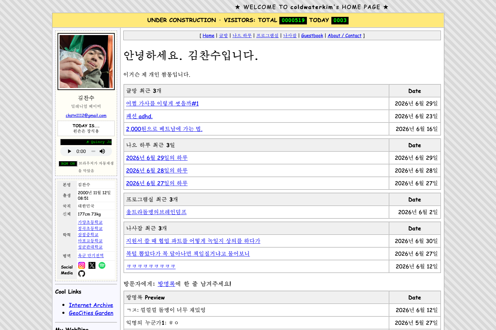

# coldwaterkim.com



개인 글, 하루 기록, 만든 프로그램, 이미지 아카이브, 방명록을 한곳에 모아두기 위해 만든 개인 홈페이지와 CMS입니다.

- Live: <https://coldwaterkim.com/>

## 만든 이유

만든 것과 쓴 글이 여러 서비스에 흩어져 있으면, 나중에 다시 보여주거나 정리하기 어렵습니다. 저는 개인 홈페이지를 단순한 프로필 링크가 아니라, 제가 만든 것과 생각한 것을 계속 쌓아두는 작업 공간으로 만들고 싶었습니다.

또한 글을 쓰거나 이미지를 올릴 때마다 별도 관리자 페이지로 이동하는 방식보다, 실제 공개 화면을 보면서 바로 고칠 수 있는 구조가 더 자연스럽다고 판단했습니다.

## 해결 방식

공개 사이트 안에 `OWNER MODE`를 넣었습니다. 방문자는 90년대 개인 홈페이지 느낌의 공개 화면을 보고, 관리자인 저는 로그인 후 같은 화면에서 글과 미디어를 추가하거나 수정합니다.

공개 페이지에 처음 들어오면 필수 BGM 입장 화면이 먼저 열립니다. 실제 음악 재생이 성공해야 본문이 보이고, 같은 탭 안에서 글방과 다른 공간을 오갈 때는 입장 화면과 음악을 다시 시작하지 않습니다. 입장 화면은 오늘의 BGM, KST 날짜별 주인장 한 줄, 이 브라우저의 지난 입장 이후 새 소식을 함께 보여줍니다.

사이트 이동 시 왼쪽 프로필과 BGM 플레이어는 유지하고, 오른쪽 본문 영역만 교체되도록 만들었습니다. 덕분에 글방, 나으 하루, 프로그램실, 나사잡, 방명록을 오가도 음악이 끊기지 않습니다.

## 구현한 것

- 글방, 나으 하루, 프로그램실, 나사잡, 방명록, About 페이지
- 공개 화면 위에서 열리는 `OWNER MODE`
- 통합 글쓰기 흐름과 카테고리별 작성 화면
- 이미지, 영상, 오디오, PDF 업로드
- 방문자 수, 방명록, 글 조회수 관리
- 필수 BGM 입장 화면과 브라우저별 새 소식 안내
- PocketBase 기반 CMS/API 연동
- GitHub Pages 프론트엔드 배포와 별도 PocketBase API 서버 운영

## 기술 구성

- Vite
- HTML, CSS, JavaScript
- PocketBase
- BlockNote 기반 WYSIWYG Markdown 작성기
- GitHub Pages
- Caddy / PocketBase 서버 운영 스크립트

## 실행 방법

아이맥에서의 기준 작업 폴더:

```bash
cd ~/Code/coldwaterkim.github.io
```

예전 iCloud Documents 안의 작업 폴더는 보관용으로만 두고, 새 작업/커밋/푸쉬는 이 로컬 clone에서 진행합니다.

로컬 프론트엔드 확인:

```bash
npm install
npm run dev
```

운영 CMS 데이터를 로컬 화면에서 확인할 때:

```bash
npm run dev:live-cms
```

이 모드는 운영 PocketBase를 바라보므로, 로그인 후 저장하면 실제 운영 데이터가 바뀔 수 있습니다.

프로덕션 빌드:

```bash
npm run build
```

## 현재 범위

이 저장소는 개인 홈페이지의 프론트엔드, CMS 연동 코드, 배포/운영 스크립트를 함께 담고 있습니다. PocketBase 데이터와 운영 비밀값은 저장소에 포함하지 않습니다. 더 자세한 서버 이관 및 백업 절차는 `deploy/` 문서에 따로 정리되어 있습니다.
